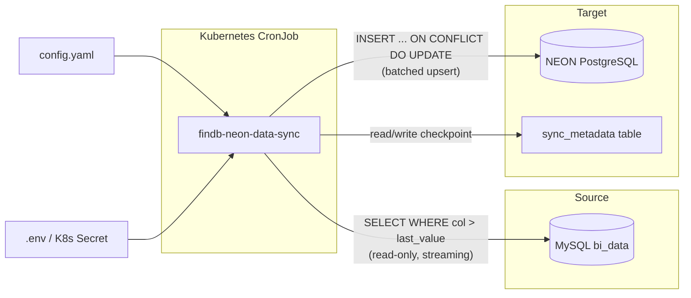
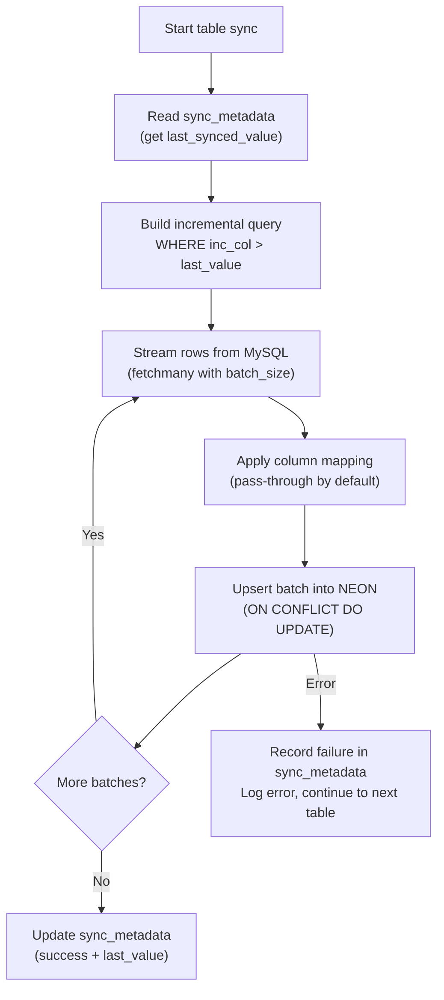

# Architecture — findb-neon-data-sync

## Overview

findb-neon-data-sync is a batch ETL application that incrementally transfers rows from a MySQL source database (bi_data) to a NEON (managed PostgreSQL) target for the finDB project. It is designed to run as a Kubernetes CronJob on a configurable schedule.

## Data Flow

## Sync Pipeline (per table)

## Module Responsibilities

| Module | Responsibility |
|--------|---------------|
| `src/main.py` | CLI entry point, argument parsing, orchestration loop |
| `src/config.py` | Pydantic settings (env vars) + YAML table config parsing |
| `src/database.py` | SQLAlchemy engine creation for MySQL (read-only) and NEON |
| `src/models.py` | `sync_metadata` ORM model + auto-migration |
| `src/sync_service.py` | Per-table sync logic: diff query, batch streaming, upsert, metadata updates |
| `src/column_mapper.py` | Column name/type translation (pass-through for now) |

## Key Design Decisions

- **State in database, not files**: Sync checkpoints are stored in the `sync_metadata` table on NEON, avoiding the need for PersistentVolumeClaims in Kubernetes.
- **Read-only MySQL session**: The MySQL connection is set to `TRANSACTION READ ONLY` to prevent accidental writes to the source.
- **Streaming reads**: `stream_results=True` with `fetchmany()` keeps memory bounded regardless of table size.
- **PostgreSQL-native upsert**: Uses `INSERT ... ON CONFLICT DO UPDATE` via SQLAlchemy's PostgreSQL dialect for atomic insert-or-update.
- **MySQL-to-PostgreSQL type mapping**: Automatic conversion of MySQL-specific types (VARCHAR with collation, TINYINT, DECIMAL, etc.) to PostgreSQL-compatible equivalents.
- **Configurable primary key override**: The target table's primary key is defined in `config.yaml`, allowing it to differ from the MySQL source PK.
- **Column mapper as extension point**: The `ColumnMapper` class is a thin pass-through today but provides the interface for future name/type remapping when MySQL and NEON schemas diverge.
